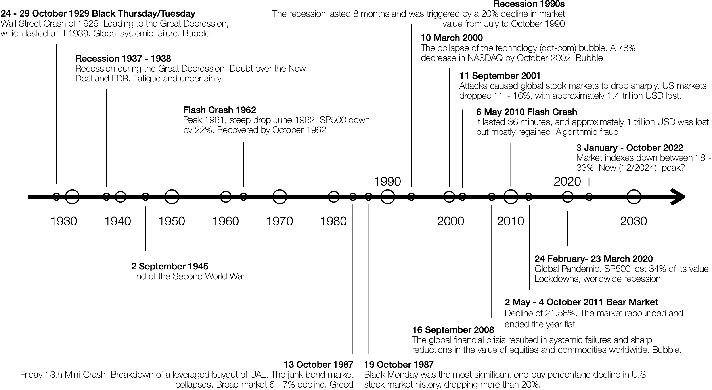
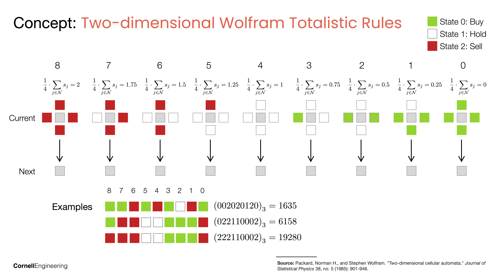

# L15b: The End, or is it Just the Beginning?
In this lecture, we review the key concepts covered throughout the course and discuss potential next steps for further learning and exploration in the field. We will also reflect on how to apply the knowledge gained in real-world scenarios and consider future trends and developments in the Quant. Finally, we outline the 2025 TradeBot. 

> __Learning Objectives:__
> 
> By the end of this lecture, you should be able to:
> * __Identify patterns in historical market crashes:__ Understand how investor psychology drives market dynamics, from euphoria to panic, through examples such as the 1929 Wall Street Crash, 1987 Black Monday, and the 2008 Global Financial Crisis.
> * __Simulate market dynamics using agent-based Wolfram Markets:__ Model agent behavior with cellular automata rules where each rule represents a policy mapping neighbor states to buy, hold, or sell actions, and observe emergent phenomena such as crashes and recoveries.
> * __Implement a TradeBot using EMA crossover and utility-based allocation:__ Combine exponential moving average signals to set risk aversion, apply Single Index Model share allocation, and execute a rebalancing schedule to manage portfolio positions over time.

Let's get started!

___

## Examples
Today, we will use the following examples to illustrate key concepts:

> [▶ Let's explore a collection of simple and expert agents](CHEME-5660-L15a-Example-Wolfram-NetworkSimulation-Fall-2025.ipynb). In this example, we build a homogeneous collection of Wolfram market agents using simple rules. These agents watch experts and mimic their actions, leading to emergent market dynamics. We analyze how the collective behavior of these agents influences market stability and price movements.

> [▶ Let's build a heterogeneous agent collection leading to a market crash](CHEME-5660-L15a-Example-Wolfram-NetworkSimulation-Crash-Fall-2025.ipynb). In this example, we build a Wolfram market simulation in which a collection of agents interacts to produce a market crash. We show that by combining different agent strategies, the market can experience sudden downturns.

> [▶ Let's test our trade-bot idea using synthetic data](lectures/week-15/L15b/CHEME-5660-L15b-Example-MyTradeBot-Synthetic-Fall-2025.ipynb). In this example, we implement the 2025 TradeBot using synthetic market data. We simulate a market environment and evaluate the performance of the TradeBot over a specified period compared with a benchmark and a risk-free alternative strategies. The notebook walks through the initialization, daily trading loop, and final portfolio evaluation, providing insights into the bot's trading strategy and effectiveness. The implementation is in the `lectures/week-15/L15b/src` directory.
___

    

        
    

## Why do markets crash?
Markets are man-made systems, and like all man-made systems, they fail. The interesting part is why they fail, and what it says about us. To quote from the 2008 Financial Crisis Inquiry Commission Report:

> __The Crisis Was Avoidable__
>
> "We conclude this financial crisis was avoidable. The crisis was the result of human action and inaction, not of Mother Nature or computer models gone haywire. The captains of finance and the public stewards of our financial system ignored warnings and failed to question, understand, and manage evolving risks within a system essential to the well-being of the American public. Theirs was a big miss, not a stumble. While the business cycle cannot be repealed, a crisis of this magnitude need not have occurred. To paraphrase Shakespeare, the fault lies not in the stars, but in us."
> 
> The Financial Crisis Inquiry Report: Final Report of the National Commission on the Causes of the Financial and Economic Crisis in the United States. https://www.govinfo.gov/app/details/GPO-FCIC

Understanding the causes of market crashes is crucial for investors, policymakers, and economists. Here are a few landmark breaks that show how investor psychology swings from euphoria to panic:

> __Historical Market Crashes__
>
> There have been __many__ historical (and more recent) downturns and outright crashes that illustrate the dynamics of investor psychology and market dynamics. Here are a few notable examples:
> - **1637 Tulip Mania (Feb 1637)**: Speculative frenzy over tulip bulbs led to prices soaring to absurd levels; when buyers vanished, prices collapsed. The mania highlighted the dangers of speculation and herd behavior in markets. [Tulip Mania Article](https://www.britannica.com/event/Tulip-mania)
> - **1929 Wall Street Crash (Oct 1929)**: Margin-fueled speculation and slowing earnings met a sudden loss of confidence; euphoria flipped to fear as leveraged investors rushed to cover. The crash fed bank failures and a deep slump, prompting reforms that later created the SEC and stricter disclosure rules. [Federal Reserve History](https://www.federalreservehistory.org/essays/stock-market-crash-of-1929) · [FRASER archival docs](https://fraser.stlouisfed.org/title/stock-market-1929-revisited-3599)  · [The lessons of the Stock Market crash of 1929 - CBS News](https://www.yout-ube.com/watch?v=26WMF7Xdb0E).
> - **1987 Black Monday (Oct 19, 1987)**: Portfolio insurance and program trading amplified a slide; herd-like selling fed on itself once screens turned red. The one-day 22.6% Dow drop led to circuit breakers and cross-market coordination. [Presidential Task Force on Market Mechanisms, 1988 (Brady Report)](https://fraser.stlouisfed.org/title/report-presidential-task-force-market-mechanisms-5732)
> - **2007-2008 Global Financial Crisis**: A housing bubble, subprime leverage, and opaque structured products cracked when defaults rose and trust evaporated; faith that house prices only go up left investors slow to react. Panic froze credit, leading to rescues and reforms (e.g., stress tests, higher capital) to rebuild confidence. [Financial Crisis Inquiry Commission Report](https://www.govinfo.gov/content/pkg/GPO-FCIC/pdf/GPO-FCIC.pdf)
> - **April 2025 Tariff Mini-Crash**: Tariff announcements and retaliation fears triggered fast algorithmic selling as investors reassessed earnings and supply chains; policy uncertainty hit sentiment first, fundamentals second. Losses eased after policy clarifications, but the episode underscored how policy shocks and crowding can spark sharp swings. [USTR press releases, April 2025](https://ustr.gov/about-us/policy-offices/press-office/press-releases/2025/april)
> 
> The unifying theme across these crashes is the interplay of investor psychology, market dynamics, and external shocks. Euphoria and greed can drive prices to unsustainable levels, while fear and panic can lead to rapid sell-offs. Understanding these dynamics is crucial for managing risk and making informed investment decisions.

One (bottom up) approach to understanding market crashes is agent-based modeling.

    

        
    

## Wolfram Markets
Wolfram Markets is a family of agent-based models that simulate financial markets using simple rules and interactions among agents. These models help us understand how individual behaviors can lead to emergent phenomena such as market crashes and bubbles.

> __Wolfram Markets Overview__
> 
> This idea is inspired by Stephen Wolfram's work on cellular automata and complex systems. In Wolfram Markets, agents are represented as cells on a grid, each following a simple set of rules (Wolfram rules) that dictate their behavior based on the states of their neighboring cells. The agents can represent traders who make decisions to buy, hold, or sell assets based on local information.
> 
> In our case, let's use a three-color two-dimensional cellular automaton: [Chapter 3, A World of Simple Programs, A New Kind of Science, 2002](https://cornell.box.com/s/10md9xuf184a6s3c25n6005uuia7da1e)

Think of each Wolfram rule as a policy $\pi(s)=\arg\max_{a}Q(s,a)$ where the state $s$ is the neighbor configuration and the action $a\in\{\text{buy},\text{hold},\text{sell}\}$ is encoded as the next cell color. Let's outline the simulation procedure for Wolfram Markets.

#### Pseudo-code
__Initialize__
* Define a grid of height $H$ and width $W$ with fixed boundaries; each interior cell hosts one agent. The color set has $k=3$ possible actions (buy/hold/sell).
* For each agent $a\in A$, specify its rule (policy) $\pi_{a}$ and the neighbor list that defines its state vector $s\in\{0,1,2\}^{m}$.
* Set the initial frame $F_{1}$ (colors for all cells) and optionally an exclusion set $E$ of coordinates that stay frozen. Store $F_{1}$ in a history array $\{F_{t}\}_{t=1}^{T}$.

__Update step__ (for $t=2,\dots,T$)
1. Start from the previous frame: $F_{t-1}$.
2. Sweep interior coordinates $(r,c)$ with $2\le r\le H-1$, $2\le c\le W-1$:
   * If $(r,c)\in E$, set $F_{t}(r,c)=F_{t-1}(r,c)$ (frozen cell).
   * Otherwise, read the neighbor state $s_{r,c}$ from $F_{t-1}$ using the agent’s neighbor list.
   * Map the neighborhood state to an index:
     - __Elementary rule__: interpret $s_{r,c}$ as a base-$k$ number to get index $i$.
     - __Totalistic rule__: compute a weighted sum $\mu=w\cdot s_{r,c}$, round or bucket $\mu$, and look up index $i$ from a table.
   * Apply the policy: next color $a_{r,c}=\pi_{a}(s_{r,c})$ is the entry in the agent’s rule at index $i$. Set $F_{t}(r,c)=a_{r,c}$.
3. Store the completed frame $F_{t}$ in the history.

__Output__
The history $\{F_{t}\}_{t=1}^{T}$ captures the market state/action pattern implied by each agent’s policy over time (e.g., buy/hold/sell encoded as colors).

Let's look at two example Wolfram Market simulations using different rulesets to see how agent interactions can lead to complex market dynamics, including crashes and recoveries.

> __Examples (from L15a)__
>
> [▶ Let's explore a collection of simple and expert agents](CHEME-5660-L15a-Example-Wolfram-NetworkSimulation-Fall-2025.ipynb). In this example, we build a homogeneous collection of Wolfram market agents using simple rules. These agents watch experts and mimic their actions, leading to emergent market dynamics. We analyze how the collective behavior of these agents influences market stability and price movements.

> [▶ Let's build a heterogeneous agent collection leading to a market crash](CHEME-5660-L15a-Example-Wolfram-NetworkSimulation-Crash-Fall-2025.ipynb). In this example, we build a Wolfram market simulation in which a collection of agents interacts to produce a market crash. We show that by combining different agent strategies, the market can experience sudden downturns.

___

## Let's take humans out of the trading loop
If human psychology drives market dynamics, what if we could take humans out of the market trading loop?

> __Let's build a perpetual money machine__
>
> My ultimate dream is to think of markets as an unparalleled wealth generation machine. If we could build agents that trade on our behalf, we could do whatever we wanted. Think of all the wonderful things we could do, problems we could solve, if we worked on what we want to do, instead of working for a living.
>
> Could markets be our ticket to a Star Trek-like post-scarcity society, where resources are abundant and freely available to all? Could we achieve the dream of universal basic income, where everyone has enough to live comfortably without the need for traditional employment?
> 
> Let's take a (mini) step toward this dream: Let's introduce the 2025 TradeBot!

### Pseudo-code 2025 TradeBot
Before we dig into the details, let's outline the key ideas behind the 2025 TradeBot. 

The TradeBot combines three moving parts: (i) an exponential moving average (EMA) crossover that sets the risk aversion $\lambda_{t}$, (ii) a Single Index Model (SIM) share allocator that maps the budget $B_{t}$, price vector $p_{t}$, and market factor $g_{m,t}$ to positions, and (iii) a binary reallocation schedule $a_{t}\in\{0,1\}$ that decides when to rebalance.

__Initialization__
1. Generate a synthetic market price path $S_{t}$ and compute short/long EMAs with windows $N_{0}$ and $N_{1}$; define the warmup offset $t_{0}=N_{0}+N_{1}$.
2. From the EMA crossover, build a sentiment series $\lambda_{t} = -G\bigl(\bar{S}^{(s)}_{t}/\bar{S}^{(l)}_{t} - 1\bigr)$ where $G>0$ is a gain constant; smooth the market growth signal into $g_{m,t}$ using an EMA of returns.
3. Assemble the investor context: initial budget $B$, ticker universe, price matrix (rows indexed by $t$ give $p_{t}$), SIM parameters $(\alpha_{i}, \beta_{i})$, risk floor $\epsilon$, time step $\Delta t$, and market factor path $g_{m,t}$.
4. Choose a reallocation plan $a_{t}$ (1 = rebalance, 0 = hold) and seed the portfolio after warmup: compute initial positions $(n_{0}, \gamma_{0}, \text{cash}_{0})$ with the share allocator at $t=t_{0}$, where $n_{t}$ is the share vector and $\gamma_{t}$ are preference weights.

__Daily loop__
For $t = t_{0}+1,\dots,t_{0}+T$ __do__:
1. Observe the reallocation flag $a_{t}$.
2. If $a_{t}=1$ (rebalance):
   * Carry forward prior positions $(n_{t-1}, \text{cash}_{t-1})$.
   * Liquidate at current prices $p_{t}$ to get available capital $B_{t} = \text{cash}_{t-1} + \sum_{i} n_{t-1,i}\,p_{t,i}$.
   * Set the risk preference to yesterday's sentiment $\lambda_{t-1}$ from the EMA signal.
   * Run the SIM allocator to obtain new holdings $(n_{t}, \gamma_{t}, \text{cash}_{t})$ given $(B_{t}, p_{t}, g_{m,t}, \lambda_{t-1})$.
3. If $a_{t}=0$ (hold):
   * Propagate the prior allocation: $(n_{t}, \gamma_{t}, \text{cash}_{t}) = (n_{t-1}, \gamma_{t-1}, \text{cash}_{t-1})$.

__Utility intuition__
The SIM allocator is the closed-form solution of a Cobb–Douglas-style utility where each ticker’s preference weight $\gamma_{i}$ depends on its risk-adjusted growth (via $\alpha_{i}, \beta_{i}$) and the market factor $g_{m,t}$. Preferred assets ($\gamma_{i}>0$) get budget-weighted allocations; non-preferred assets are pinned to a minimum $\epsilon$ share floor.

__Output__
A history indexed by trading day that stores positions $n_{t}$, the prices used for fills $p_{t}$, preference weights $\gamma_{t}$, ticker order, and any unallocated cash carried to the next step.

> __Example__
> 
> [▶ Let's test our trade-bot idea using synthetic data](lectures/week-15/L15b/CHEME-5660-L15b-Example-MyTradeBot-Synthetic-Fall-2025.ipynb). In this example, we implement the 2025 TradeBot using synthetic market data. We simulate a market environment and evaluate the performance of the TradeBot over a specified period compared with a benchmark and a risk-free alternative strategies. The notebook walks through the initialization, daily trading loop, and final portfolio evaluation, providing insights into the bot's trading strategy and effectiveness. The implementation is in the `lectures/week-15/L15b/src` directory.

___

## If we only had more time.
In this course, we have just barely scratched the surface! There are __so many__ directions we could go, and so many more interesting ideas we could explore if we only had more time. Many students have asked about next steps, so here are a few suggestions:
* __Give me a job?__ You could always form an AI-quant startup, and hire me to think about these problems full time, and write excellent Julia code: [The Math Legend Who Just Left Academia—for an AI Startup Run by a 24-Year-Old](https://apple.news/A0Er3cp4vQy65FqiG3-YFOg)
* __Independent Projects?__: Consider pursuing independent projects that delve deeper into specific topics covered in the course. This could involve building more sophisticated agent-based models, exploring alternative trading strategies, or analyzing real-world market data. Sign up for CHEME-4900/5999 for independent study credit!
* __Other Courses__: Look for other courses in computational finance, machine learning, or complex systems that build on the foundations laid in this course. These courses can provide deeper insights and more specialized knowledge. For example, [check out the ORIE Spring 2026 course offerings!](https://classes.cornell.edu/browse/roster/SP26/subject/ORIE)

Finally, on behalf of the entire teaching team, and myself, thank you for being part of this journey. I hope you found the course engaging and thought-provoking. Keep exploring, stay curious, and continue learning! And as always, happy trading!
___

## Summary
This lecture explored market crashes, agent-based market simulations, and the design of an automated trading agent.

> __Key Takeaways:__
> 
> * **Market crashes result from human psychology and behavior:** Historical crashes from Tulip Mania to the 2008 Financial Crisis share common dynamics where euphoria drives prices up and panic triggers rapid sell-offs. Understanding these patterns helps investors manage risk.
> * **Wolfram Markets model emergent market dynamics from simple rules:** Each agent follows a deterministic policy (Wolfram rule) that maps neighbor states to actions. Homogeneous and heterogeneous agent collections produce different market behaviors, including crashes and recoveries.
> * **The 2025 TradeBot combines technical signals with utility-based allocation:** EMA crossover signals set risk aversion, the Single Index Model allocator maps budget and prices to positions, and a rebalancing schedule determines when to trade. This framework provides a foundation for automated portfolio management.

The concepts and tools from this course provide a starting point for building more sophisticated trading systems and exploring computational finance.

___

## Disclaimer and Risks
__This content is offered solely for training and informational purposes__. No offer or solicitation to buy or sell securities or derivative products or any investment or trading advice or strategy is made, given, or endorsed by the teaching team. 

__Trading involves risk__. Carefully review your financial situation before investing in securities, futures contracts, options, or commodity interests. Past performance, whether actual or indicated by historical tests of strategies, is no guarantee of future performance or success. Trading is generally inappropriate for someone with limited resources, investment or trading experience, or a low-risk tolerance. Only risk capital that is not required for living expenses should be used.

__You are fully responsible for any investment or trading decisions you make__. Such decisions should be based solely on evaluating your financial circumstances, investment or trading objectives, risk tolerance, and liquidity needs.

___
